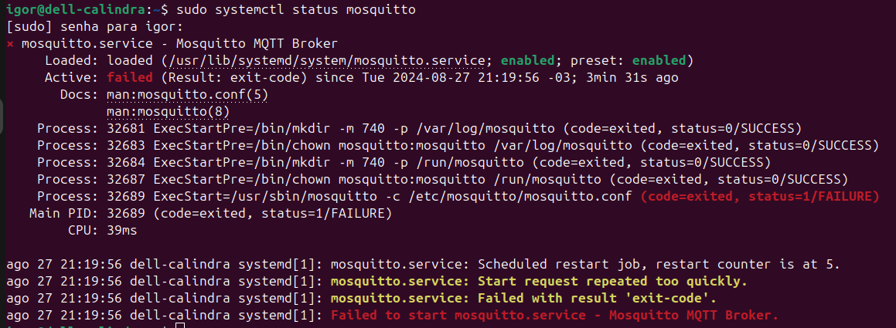
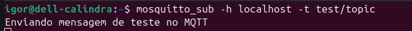
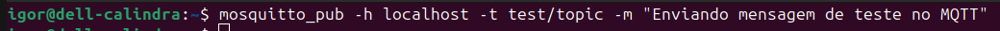

# Tarefa feita no dia 27-08-2024

## 🦟 Instalação do Mosquitto no Linux

Existe algumas formas de fazer essa instalação. A que foi utilizar por mi m (Igor Mariano) foi executar o comando abaixo no terminal;


### Passo 1: Instalar o Mosquitto
Esse comando foi utilizado na distribuição  ubuntu do linux na versão 24.04 LTS
```
sudo apt-get install mosquitto
```

Outra forma de fazer isso seria executando o seguinte comando no termianl

```
sudo apt-get install mosquitto mosquitto-clients
```

### Passo 2: Iniciar o Broker Mosquitto
O Mosquitto normalmente inicia automaticamente após a instalação. Você pode verificar o status e iniciar manualmente se necessário:

```
sudo systemctl start mosquitto
sudo systemctl enable mosquitto
```
OBS: Pode ser que ocorra alguma falha do tipo abaixo, porém você pode verificar se de fato o MQTT está funcionando executando os **comandos do passo 3**



### Passo 3: Testar a Configuração (LOCALMENTE)

1 - Abra um terminal para se inscrever (subscribe) em um tópico MQTT:

```
mosquitto_sub -h localhost -t test/topic
```
Aqui, -h localhost especifica o host, e -t test/topic é o tópico no qual você está se inscrevendo.


Exemplo utilizado no terminal


2 - Abra outro terminal para publicar (publish) uma mensagem nesse tópico:

```
mosquitto_pub -h localhost -t test/topic -m "Hello, MQTT!"
Aqui, -m "Hello, MQTT!" é a mensagem que você está publicando.
```

Exemplo utilizado no terminal



⚠️ **OBS: Esses comandos devem estar rodando em terminais diferentes para funcionar.**
